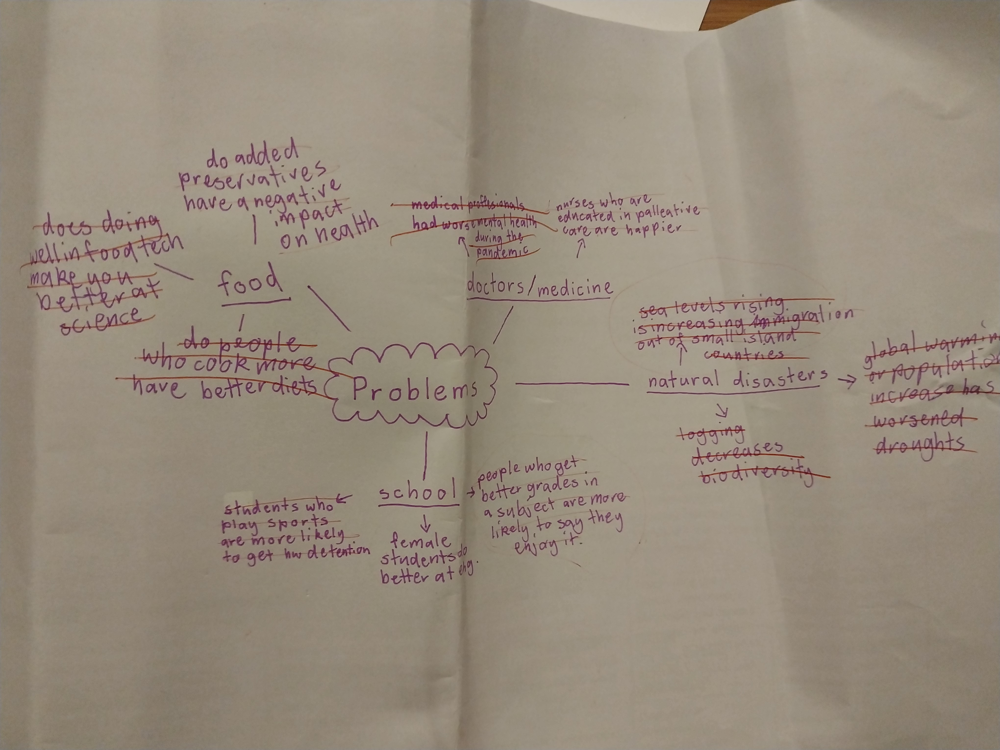

# 9CT_Task_3
# Requirements Outline
### Mind Map 

### Functional Requirements
- Loading: The system should be able to load the correct files and display an error message if the file is missing
- Cleaning: The system should be able to handle missing values in the data
- Analysis: The system should be able to handle statistical analysis in the form of calculating the mean and median for the data
- Visualisation: The data should be clearly visualised in different forms including matplotlib charts which display the difference between female and male performance
- Reporting: The final data will need to be stored in a .csv file
### Non-Functional Requirements
- Usability: The user should be able to navigate the UI and access data/data visualisations with ease, and understand the purpose, scope, and origins of data used in the project from the README.md
- Reliability: The data used for the project should be a truthful representation of the students' performance and recent
### Use Case
#### Actor: User
#### Goal: For the user to interact and access with collected data and visualisations through the UI
#### Preconditions:
- The dataset has already been preloaded into the system by an administrator / programmer. 
- The user can acess the UI
#### Main Flow:
1. The user opens the program and sees a text-based menu
2. The menu gives them the option to view:
    - A visualisation of the performance of female and male students in the most recent english NAPLAN and HSC results
    - Search or filter data from different states, demographics, language backgrounds, etc.
    - Update a data entry to change a value or correct an error
3. The program performs the user's selected action
#### Postconditions:
- The user has accessed and interacted with the data
- The updates the user has made to the data are saved
- The data is still accessible

# Research
### Relevant Sources
#### International Sources:
- https://today.ucsd.edu/story/girls-excel-in-language-arts-early-which-may-explain-the-stem-gender-gap-in-adults
- https://ed.stanford.edu/news/new-stanford-education-study-shows-where-boys-and-girls-do-better-math-english
- https://news.griffith.edu.au/2018/09/21/girls-better-readers-and-writers-than-boys-study/
- https://www.cambridgeassessment.org.uk/Images/gender-differences-cambridge-english.pdf
#### Australian Sources:
- https://www.theguardian.com/education/2009/apr/21/girls-boys-english-grades
- https://www.smh.com.au/national/nsw/girls-now-out-performing-boys-in-nearly-every-hsc-subject-20221209-p5c56d.html
- https://www.unsw.edu.au/newsroom/news/2018/09/study-reveals-patterns-in-stem-grades-of-girls-versus-boys

### SEE-I Paragraph
Girls routinely outperform boys in english and other humanities subjects which has been hypothesised to be the result of either the biological differences between male and female brains or the social expectations that are pushed onto young girls. When a child is being taught reading comprehension or writing in primary school, studies show that they are more likely to sit and focus on the work for longer if they're female. Imagine you're teaching two children; one is a girl, one is a boy. Which would you expect to sit quietly and complete work? The girl, right? This is because of the differences in attention span between girls and boys. On the other hand this could be because parents often push girls to be more socially aware, aiding them in language acquisition and promoting skills essential for reading and writing. For example, reading to children or encouraging kids to read independently when they're old enough are activities that parents are more likely to expect of a girl.

These two theories could be responsible, not only for the difference in female and male english scoring, but also the STEM gender gap which is later observed in adults because if someone is better at a subject when they're young they're more likely to continue it later in life, which for girls is usually humanities subjects and STEM subjects for boys. Therefore, encouraging more male participation in early literacy promoting activities and female engagement in maths and science is vital to get a diverse range of genders in different fields.

#### Planning
- Girls seem to routinely outperform boys in english as well as other humanities subjects. x
- This could be because of biological differences between male and female brains, or could be because of the social expectations placed on girls from childhood. x
- Girls tend to be better at focusing when they're young, which means that they're more receptive to language teaching which is taught better to kids than STEM subjects in general. Boys on the other hand find it harder to focus duri
- Parents expect girls to be more socially and linguistically aware rather than expecting them to be good at STEM, leading to earlier language development which helps them in humanities subjects
- (STEM gender gap)
- These things are succeptible to change in different socio-economic and cultural climates, though. For example, girls tend to worse than boys at maths in wealthy areas while they outperform them in lower socio-economic zones.
- Parents invest more in their daughters' education and parents are better at teaching literacy through books and writing, but aren't as aware of how to make STEM seem interesting to children which means that girls become more interested in the humanities

# Data Dictionary
| Field | Datatype     | Format For Display   |  Description | Example  | Validation  |
|---------- |---------- |----------------   |--------------- | ------ | --------- |
|  Year   |   datetime64  |   YYYY | The year the NAPLAN test was taken  | 2018 | Must be a 4 digit number |
|  Male Reading Mean / (S.D.) |  float64 | NNN.NN (NN.N)  | The average of male year 7 NAPLAN results for the reading test and the standard deviation of their scores in brackets | 540.8 (68.6) | Must have brackets |
|  Male Reading % at or above NMS | float64 | NN.N | The percentage of male students who are meeting the national minimum standards for year 7 reading | 83.7 | Must be a number less than 100 with one decimal place |
| Female Reading Mean / (S.D.) | float64 | NNN.NN (NN.N) | The average of female year 7 NAPLAN results for the reading test and the standard deviation of their scores in brackets | 571.9 (57.9) | Must have brackets | 
| Female Reading % at or above NMS | float64 | NN.N | The percentage of female students who are meeting the national minimum standards for year 7 reading | 87.9 | Must be a number less than 100 with one decimal place |
|  Male Writing Mean / (S.D.) |  float64 | NNN.NN (NN.N)  | The average of male year 7 NAPLAN results for the writing test and the standard deviation of their scores in brackets | 540.8 (68.6) | Must have brackets |
|  Male Writing % at or above NMS | float64 | NN.N | The percentage of male students who are meeting the national minimum standards for year 7 writing | 83.7 | Must be a number less than 100 with one decimal place |
| Female Writing Mean / (S.D.) | float64 | NNN.NN (NN.N) | The average of female year 7 NAPLAN results for the writing test and the standard deviation of their scores in brackets | 571.9 (57.9) | Must have brackets | 
| Female Writing % at or above NMS | float64 | NN.N | The percentage of female students who are meeting the national minimum standards for year 7 writing | 87.9 | Must be a number less than 100 with one decimal place |

# Evaluation
### SEE-I Paragraph
My hypothesis that girls outperform boys at english was confirmed by my analysis of Year 7 NAPLAN results. In both reading and writing girls had a higher mean score amd more girls were above the National Minimum Standard (NMS). For example, the average male score in writing was 504.6 and the average female score was 536.7, lining up with my hypothesis. However this is still a relatively small difference that was subjected to change over the 2008-2022 period only in Australia so whether this is representative of broader sociiety would need to be investigated further.

### Peer PMI Verification - Evelyn
| Plus | Minus | Implication |
|----- |------ |-------------|
| You have all the averages | If I put in the wrong answer when it asks if I want to see it was a graph it takes me back to the main menu also you don't have the median | The UX is pretty annoying to deal with but the data is easy to see in the visualisations |
| You've got variety in the types of charts | It's confusing to me that the male and female lines are the opposite way around to the legend | You can see the data in different ways but they aren't super readable |
| Your charts have different colours | The main menu isn't visual | The charts having blue and red being boy or girl kind of helps with the readability but also it's just nice to look at. If you were going to improve your project I would say making the main menu visual would be the next thing to do |

#### Evaluate your system and results in relation to your Requirements Outline
My system is able to calculate the means of the data, fulfilling the analysis aspect of the requirements outline but doesn't calculate the median because I decided that wasn't necessary for understanding the data. My system also effectively visualises the data in the form of different matplotlib charts that display the differences between female and male performance, also giving the project a high readibility. However, the UI isn't able to be navigated with ease and I didn't get time to code an error message if the data is missing, failing the loading aspect of the requirements outline.
#### Evaluate your system in relation to peer feedback
The peer feedback suggests that I could improve on the UX by making it a visual menu and allowing the user to go back to the averages instead of the main menu if they input something invalid on option 4 and that I could swap the titles of Male and Female around on the legend so they were in the same order as they are on the chart. These improvements would hopefully fix the readability issues that were Evelyn's main concern. The feedback also highlights the diversity in chart types which I think is something I did well in this project, however if I had more time I might add even more comparing the averages of reading and writing over time, for example. Overall, I think Evelyn's feedback was quite positive but there's definitely room for improvement in the readability and UX.
#### Evaluate your project in relation to project management
I don't believe I managed my time as effectively as possible during this project. I procrastinated on a lot of the research aspects and ended up having to do them all towards the end of the project. However, I don't believe my github commits are a good measure of this because github desktop wasn't downloaded on my PC originally, meaning I had to do my theory in a seperate file which I later transferred to my project, so my github commits make it look much worse than it actually was. In the future I'd want to front load the theory work to give myself more time for the coding which I did entirely on one weekend which is less than ideal.
#### Evaluate your system in in relation to its data and security
- Is the data valid, accurate, and timely? The dataset doesn't include data from 2023, 2024, or 2025 because of a change in the reporting of NAPLAN results which limits the timeliness of the data. The data is all accurate though, and reliable as it comes from Australian Curriculum, Assessment and Reporting Authority.
- Is it unbiased? The data is complete and paints an accurate picture of female and male performance, but the visualisations are somewhat misleading as they don't start at 0 which makes the gap in performance seem much larger than it actually is, skewing peoples' perceptions of the data. To fix this I would have to make the y axis start at 0 maybe using the ax.set_ylim() function.
- Do we need to improve its security – if so, how? The system isn't very but I don't think it really needs to be for this project. However if I were to improve the security I would use a "best practice" approach. This involves using de-identified data, which was already done by ACAR in this project, being transparent about what data is being used, and conducting risk assessments, amongst other things. These strategies would ensure that data would be protected from unauthorised access which would become more important if this project was scaled up into one involving students' personal data.
- Could the UX be more accessible – if so, how? The UX was definitely a bit clunky because it was only text based and if I wanted to improve it I would make visuals for the main menu so that it would be easier to navigate and would also be more aesthetically appealing.